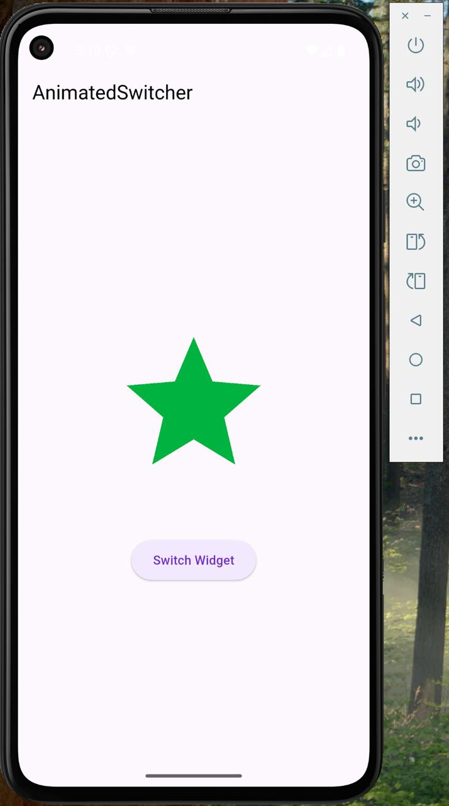

# animated_switcher 

# Brief Description
A simple Flutter app that demonstrates how to use the AnimatedSwitcher widget to toggle icons with animation.

## How to run the Project 
## Clone the repository:
```bash 
git clone https://github.com/Lisky-pixel/Widget_Presentation.git
cd Widget_Presentation
```

## 🎯 Widget Properties Demonstrated
1. duration: Controls how long the animation lasts.
2. transitionBuilder: Lets you define how widgets transition in/out.
3. switchInCurve: Controls the curve used when a new child appears.

## Screenshot



## Contributing
Contributions are welcome! If you find any issues or have suggestions for improvements, please create a new issue or submit a pull request.